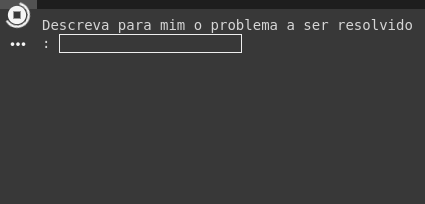
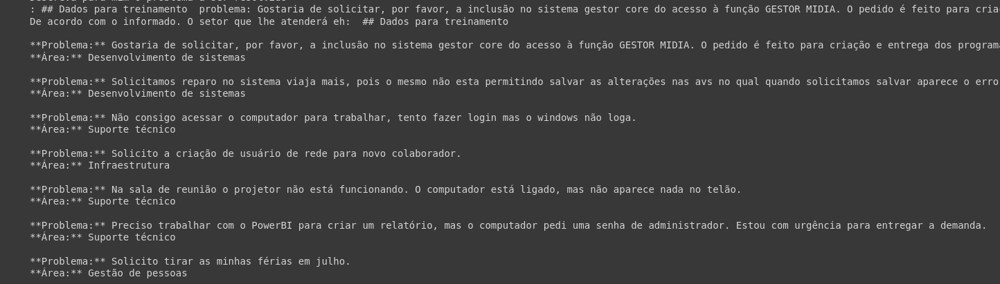
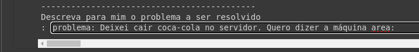
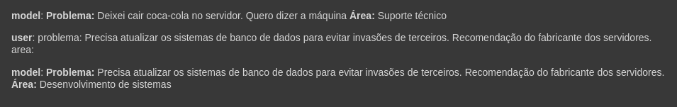

# ImersaoIA Cade o chamado 😫🥺🤩
---

 Propósito
---

Chat bot treinado com a [IA Gemini](https://aistudio.google.com/) do Google cujo proposito e evitar erros no envio das demandas e solicitações abertas pelos seus clientes, funcionários para a resolução de problemas como por exemplo:
- Resolução de erros em um web site;
- Falha na autenticação na estação de trabalho
- Solicitação de férias
- dentre outros

Autores
---

- Marcos Sousa: [estevamdf2](https://github.com/estevamdf2)
 
 - Lucas Alencar: [lucas85cunha](https://github.com/lucas85cunha)


💻 Tecnologias 💻
---

Linguagem de programação: Python
🤖 IA Model 🤖: [IA Gemini](https://aistudio.google.com/)

Demonstração
---

Para o treinamento do chat bot usamos uma massa de teste disponível em:



Estrutura do arquivo:

```text
problema: <Breve descrição da solicitação>
area: <Area para atendimento da demanda>
--- # fim de tópico
```



Usamos a técnica **Few-shot Chain-of-Thought**: é uma maneira de fazer com que grandes modelos de linguagem (LLMs) 
realizem raciocínios complexos. Ela funciona fornecendo ao modelo instruções passo a passo sobre como chegar a uma resposta,
em vez de simplesmente pedir a resposta final.para um problema da sua vida real;

Após este processo apresentamos ao modelo treinado uma segunda massa de informações na seguinte estrutura

```text
problema: <Breve descrição da solicitação>
area:
--- # fim de tópico
```



Desta forma, espera-se que o modelo informe qual a área correta para direcionar a sua requisição de atendimento.



Melhorias e Aprimoramentos
---

Este modelo pode ser exportado e integrado a sistemas de gestão de Tickets como:

Ferramentas openSource:

- [OS Ticket](https://osticket.com/)
- [Zendesk](https://www.zendesk.com/)
- [Help Scout](https://www.helpscout.com/)

Ferramentas Pagas:

- [Freshdesk](https://www.freshworks.com/freshdesk/)
- [HappyFox](https://www.happyfox.com/)
- [Kayako](https://kayako.com/)

Outro recurso bem interessante e utilizar a API destes serviços e realizar a integração do modelo ao Whatsapp ou Telegram
Sendo que com estes aplicativos o usuário escreve a sua demanda e depois recebe o feedback informando a área a ser
aberta a demanda. Em caso de confirmação ele dispara uma requisição a ferramenta de gestão de Tickets que já abrirá o chamado
e enviara uma cópia ao solicitante.

---
_Keep calm
and use IA_
